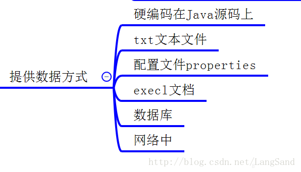

# testMarkdown

~~s暗处~~

<!--以下是本文的脚注和超链接-->

__underline__

++underline2++

<table><tr><td bgcolor=#7FFFD4>这里的背景色是：Aquamarine，  十六进制颜色值：#7FFFD4， rgb(127, 255, 212)</td></tr></table>

我是黑体字
我是微软雅黑
我是华文彩云
黑体
null
gray
